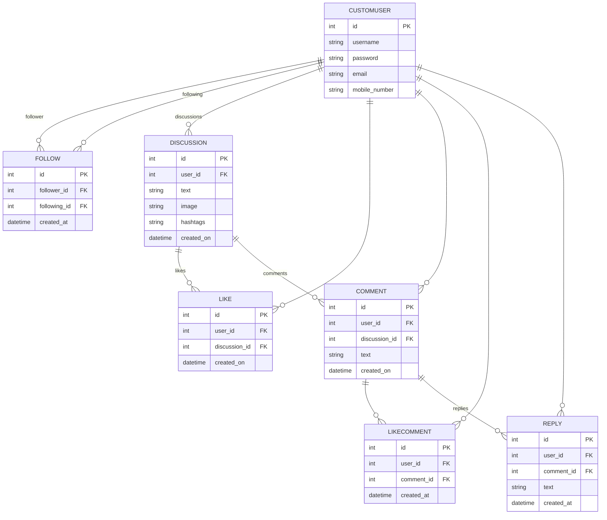

# Discussion Forum

## Low Level Design Doc


## Database Schema



## API Documentation
Base Url = `http://localhost:8000/api/`

### User Management

#### Create User

- **URL**: `/users/`
- **Method**: `POST`
- **Description**: Create a new user.
- **Request Body**:
  ```json
  {
      "username": "string",
      "email": "string",
      "mobile_number": "string",
      "password": "string"
  }
  ```
- **Response**:
  - **Success** (201 Created):
    ```json
    {
        "id": "integer",
        "username": "string",
        "email": "string",
        "mobile_number": "string"
    }
    ```
  - **Error** (400 Bad Request):
    ```json
    {
        "field": ["error_message"]
    }
    ```

#### List Users

- **URL**: `/users/`
- **Method**: `GET`
- **Description**: List all users.
- **Response** (200 OK):
  ```json
  [
      {
          "id": "integer",
          "username": "string",
          "email": "string",
          "mobile_number": "string"
      }
  ]
  ```

#### Retrieve User

- **URL**: `/users/<id>/`
- **Method**: `GET`
- **Description**: Retrieve a user by ID.
- **Response** (200 OK):
  ```json
  {
      "id": "integer",
      "username": "string",
      "email": "string",
      "mobile_number": "string"
  }
  ```

#### Update User

- **URL**: `/users/<id>/`
- **Method**: `PUT`
- **Description**: Update a user by ID. Partial updates are allowed.
- **Request Body**:
  ```json
  {
      "username": "string",
      "email": "string",
      "mobile_number": "string"
  }
  ```
- **Response** (200 OK):
  ```json
  {
      "id": "integer",
      "username": "string",
      "email": "string",
      "mobile_number": "string"
  }
  ```

#### Delete User

- **URL**: `/users/<id>/`
- **Method**: `DELETE`
- **Description**: Delete a user by ID.
- **Response** (204 No Content):
  ```json
  {}
  ```

### Authentication

### Obtain JWT Token

- **URL**: `/auth/jwt/create/`
- **Method**: `POST`
- **Description**: Obtain JWT token.
- **Request Body**:
  ```json
  {
      "username": "string",
      "password": "string"
  }
  ```
- **Response**:
  - **Success** (200 OK):
    ```json
    {
        "refresh": "string",
        "access": "string"
    }
    ```
  - **Error** (401 Unauthorized):
    ```json
    {
        "detail": "No active account found with the given credentials"
    }
    ```

#### Refresh JWT Token

- **URL**: `/api/jwt/refresh/`
- **Method**: `POST`
- **Description**: Refresh JWT token.
- **Request Body**:
  ```json
  {
      "refresh": "string"
  }
  ```
- **Response**:
  - **Success** (200 OK):
    ```json
    {
        "access": "string"
    }
    ```
  - **Error** (401 Unauthorized):
    ```json
    {
        "detail": "Token is invalid or expired"
    }
    ```

### Discussions and Comments

#### Create Discussion

- **URL**: `/discussions/`
- **Method**: `POST`
- **Description**: Create a new discussion with optional text, image, and hashtags.
- **Request Body** (form-data):
  - `text` (text): The text content of the discussion.
    - **Example**: `This is a sample post`
  - `image` (file): The image file to upload.
    - **Example**: `sample_image.jpeg`
  - `hashtags` (text): The hashtags associated with the discussion.
    - **Example**: `#SamplePost`
  - `user` (text): The ID of the user creating the discussion.
    - **Example**: `1`

Example Form-data
```
Key        | Type | Value
-----------|------|---------------------------
text       | text | This is a sample post
image      | file | sample_image.jpeg
hashtags   | text | #SamplePost
user       | text | 1
```

- **Response**:
  - **Success** (201 Created):
    ```json
    {
        "id": "integer",
        "text": "string",
        "user": "integer",
        "image": "string/null",
        "hashtags": "string",
        "created_on": "string"
    }
    ```
  - **Error** (400 Bad Request):
    ```json
    {
        "field": ["error_message"]
    }
    ```

#### List Discussions

- **URL**: `/discussions/`
- **Method**: `GET`
- **Description**: List all discussions.
- **Response** (200 OK):
  ```json
  [
      {
          "id": "integer",
          "text": "string",
          "user": "integer",
          "image": "string/null",
          "hashtags": "string",
          "created_on": "string"
      }
  ]
  ```

#### Search Discussion
- **URL**: `/discussions/search?q={yourQuery}`
- **Method**: `GET`
- **Description**: Retrieve a list of discussion by text content.
- **Response** (200 OK):
  ```json
  [
      {
          "id": "integer",
          "text": "string",
          "user": "integer",
          "image": "string/null",
          "hashtags": "string",
          "created_on": "string"
      }
  ]
  ```

#### Search Discussion By Tags
- **URL**: `/discussions/by_tags?tags={yourQuery}`
- **Method**: `GET`
- **Description**: Retrieve a list of discussion by matching tag.
- **Response** (200 OK):
  ```json
  [
      {
          "id": "integer",
          "text": "string",
          "user": "integer",
          "image": "string/null",
          "hashtags": "string",
          "created_on": "string"
      }
  ]
  ```

#### Retrieve Discussion

- **URL**: `/discussions/<id>/`
- **Method**: `GET`
- **Description**: Retrieve a discussion by ID.
- **Response** (200 OK):
  ```json
  {
        "id": "integer",
        "text": "string",
        "user": "integer",
        "image": "string/null",
        "hashtags": "string",
        "created_on": "string"
  }
  ``` 

#### Update Discussion

- **URL**: `/discussions/<id>/`
- **Method**: `PUT`
- **Description**: Update a discussion by ID. Partial updates are accepted.
- **Request Body**:
  ```json
  {
      "text": "string"
  }
  ```
- **Response** (200 OK):
  ```json
  {
      "id": "integer",
      "title": "string",
      "content": "string",
      "user": "integer"
  }
  ```

#### Delete Discussion

- **URL**: `/discussions/<id>/`
- **Method**: `DELETE`
- **Description**: Delete a discussion by ID.
- **Response** (204 No Content):
  ```json
  {}
  ```

#### Create Comment

- **URL**: `/comments/`
- **Method**: `POST`
- **Description**: Create a new comment.
- **Request Body**:
  ```json
  {
      "discussion": "integer",
      "content": "string",
      "user": "integer"
  }
  ```
- **Response**:
  - **Success** (201 Created):
    ```json
    {
        "id": "integer",
        "user": "integer",
        "discussion": "integer",
        "text": "string",
        "created_on": "string"
    }
    ```
  - **Error** (400 Bad Request):
    ```json
    {
        "field": ["error_message"]
    }
    ```

#### List Comments

- **URL**: `/comments/`
- **Method**: `GET`
- **Description**: List all comments.
- **Response** (200 OK):
  ```json
  [
      {
          "id": "integer",
          "discussion": "integer",
          "text": "string",
          "user": "integer",
          "created_on": "string"
      }
  ]
  ```

#### Retrieve Comment

- **URL**: `/comments/<id>/`
- **Method**: `GET`
- **Description**: Retrieve a comment by ID.
- **Response** (200 OK):
  ```json
  {
      "id": "integer",
      "discussion": "integer",
      "text": "string",
      "user": "integer",
      "created_on": "string"
  }
  ```

#### Update Comment

- **URL**: `/comments/<id>/`
- **Method**: `PUT`
- **Description**: Update a comment by ID. Partial updates accepted.
- **Request Body**:
  ```json
  {
      "discussion": "integer",
      "text": "string"
  }
  ```
- **Response** (200 OK):
  ```json
  {
      "id": "integer",
      "user": "integer",
      "discussion": "integer",
      "text": "string",
      "created_on": "string"
  }
  ```

#### Delete Comment

- **URL**: `/comments/<id>/`
- **Method**: `DELETE`
- **Description**: Delete a comment by ID.
- **Response** (204 No Content):
  ```json
  {}
  ```

### Likes

#### Toggle Like

- **URL**: `/likes/`
- **Method**: `POST`
- **Description**: Toggle like/unlike for a discussion or comment.
- **Request Body**:
  ```json
  {
      "discussion": "integer",
      "user": "integer" 
  }
  ```
- **Response**:
  - **Success** (201 Created or 204 No Content):
    - **Liked** (201 Created):
      ```json
      {
          "id": "integer",
          "user": "integer",
          "discussion": "integer",
          "created_on": "string"
      }
      ```
    - **Unliked** (204 No Content):
      ```json
      {}
      ```
  - **Error** (400 Bad Request):
    ```json
    {
        "field": ["error_message"]
    }
    ```

#### List Likes

- **URL**: `/likes/`
- **Method**: `GET`
- **Description**: List all likes.
- **Response** (200 OK):
  ```json
  [
      {
          "id": "integer",
          "user": "integer",
          "discussion": "integer",
          "created_on": "string"
      }
  ]
  ```

---
