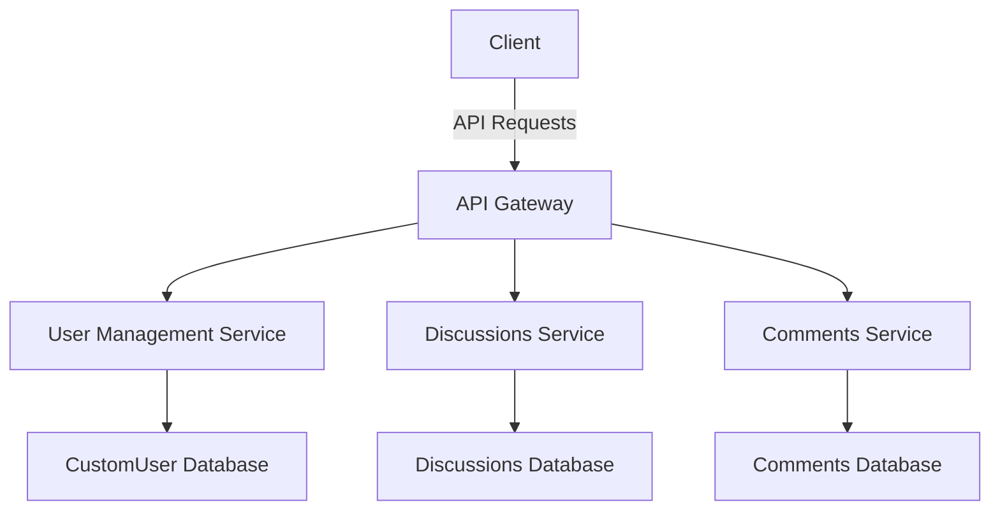
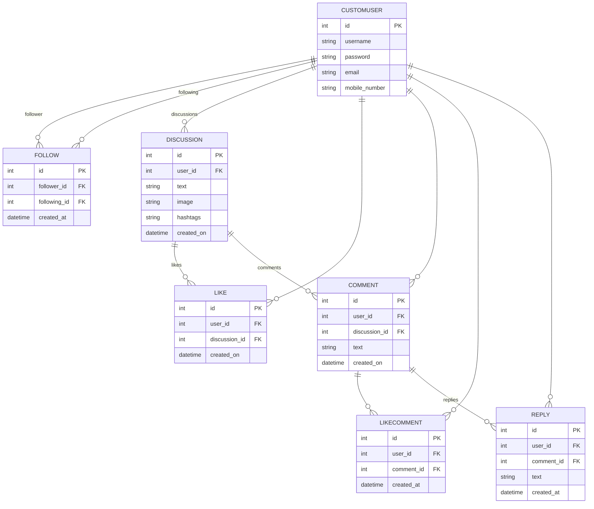

# Discussion Forum
### Setup instructions (local setup):
- Clone the repository
- Create a .env file and add the following in it:
```env
DJANGO_KEY=ANYTHING_YOU_WANT
```
- Run the following commands (Linux/OSX):
```shell
python3 -m venv assignment
source ./assignment/bin/activate
pip install -r requirements.txt

python manage.py makemigrations
python manage.py migrate 
python manage.py runserver 
```
- Now you can go to the api doc link for postman and test the api.

### Setup (Dockerized):
- Just run the following command and you're done if of course you have
docker installed:

```shell
sudo docker compose up
```
- Now you can go to the api doc link for postman and test the api.


## Low Level Design Doc
---

#### Table of Contents
1. [Introduction](#introduction)
2. [Component Descriptions](#component-descriptions)
    - [User Management Service](#user-management-service)
    - [Discussions Service](#discussions-service)
    - [Comments Service](#comments-service)
3. [System Architecture](#system-architecture)
4. [Database Schema](#database-schema)
5. [Microservice Infrastructure](#microservice-infrastructure)

---
```markdown
NOTE:
Due to time constraints this exact architecture is not implemented 
(by not implemented only containerising the services part is left). Instead 
the database has been separated from the django application as a monolith.
However, it can easily be done by contanerizing the individual apps with their own
databases. And using REDIS or RabbtMQ as a communication service b/w the containers.
Also we can even incorporate Kubernetes for managing the lots of containers 
produced this way.
```
### Introduction

This document provides a detailed low-level design of the application, including component descriptions, system architecture, database schema, and API documentation. The application is broken down into three main services: User Management, Discussions, and Comments.

### Component Descriptions

#### User Management Service

- **CustomUser Model**
  - `id`: Primary Key, Integer
  - `username`: String, Unique
  - `email`: String, Unique
  - `password`: String (hashed)
  - `mobile_number`: String, Unique

- **Follow Model**
  - `id`: Primary Key, Integer
  - `follower`: ForeignKey to `CustomUser`
  - `followed`: ForeignKey to `CustomUser`

#### Discussions Service

- **Discussion Model**
  - `id`: Primary Key, Integer
  - `title`: String
  - `content`: Text
  - `image`: File (Optional)
  - `hashtags`: String (Optional)
  - `user`: ForeignKey to `CustomUser`
  - `created_at`: DateTime
  - `updated_at`: DateTime

- **Like Model**
  - `id`: Primary Key, Integer
  - `user`: ForeignKey to `CustomUser`
  - `discussion`: ForeignKey to `Discussion`
  - `created_at`: DateTime

#### Comments Service

- **Comment Model**
  - `id`: Primary Key, Integer
  - `content`: Text
  - `user`: ForeignKey to `CustomUser`
  - `discussion`: ForeignKey to `Discussion`
  - `created_at`: DateTime
  - `updated_at`: DateTime

- **CommentLike Model**
  - `id`: Primary Key, Integer
  - `user`: ForeignKey to `CustomUser`
  - `comment`: ForeignKey to `Comment`
  - `created_at`: DateTime

- **Reply Model**
  - `id`: Primary Key, Integer
  - `content`: Text
  - `user`: ForeignKey to `CustomUser`
  - `comment`: ForeignKey to `Comment`
  - `created_at`: DateTime
  - `updated_at`: DateTime

### System Architecture



### Database Schema

#### User Management Service

- **CustomUser Table**
  - `id` (Primary Key, Integer)
  - `username` (String, Unique)
  - `email` (String, Unique)
  - `password` (String)
  - `mobile_number` (String, Unique)

- **Follow Table**
  - `id` (Primary Key, Integer)
  - `follower_id` (ForeignKey to `CustomUser`)
  - `followed_id` (ForeignKey to `CustomUser`)

#### Discussions Service

- **Discussion Table**
  - `id` (Primary Key, Integer)
  - `title` (String)
  - `content` (Text)
  - `image` (File, Optional)
  - `hashtags` (String, Optional)
  - `user_id` (ForeignKey to `CustomUser`)
  - `created_at` (DateTime)
  - `updated_at` (DateTime)

- **Like Table**
  - `id` (Primary Key, Integer)
  - `user_id` (ForeignKey to `CustomUser`)
  - `discussion_id` (ForeignKey to `Discussion`)
  - `created_at` (DateTime)

#### Comments Service

- **Comment Table**
  - `id` (Primary Key, Integer)
  - `content` (Text)
  - `user_id` (ForeignKey to `CustomUser`)
  - `discussion_id` (ForeignKey to `Discussion`)
  - `created_at` (DateTime)
  - `updated_at` (DateTime)

- **CommentLike Table**
  - `id` (Primary Key, Integer)
  - `user_id` (ForeignKey to `CustomUser`)
  - `comment_id` (ForeignKey to `Comment`)
  - `created_at` (DateTime)

- **Reply Table**
  - `id` (Primary Key, Integer)
  - `content` (Text)
  - `user_id` (ForeignKey to `CustomUser`)
  - `comment_id` (ForeignKey to `Comment`)
  - `created_at` (DateTime)
  - `updated_at` (DateTime)

### Microservice Infrastructure

To separate the application into microservices, each service (User Management, Discussions, Comments) will be a standalone service with its own database. They will communicate via REST APIs.

#### User Management Service

- **Service**: `user-service`
- **Database**: `user_db`
- **Endpoints**: User registration, login, follow/unfollow

#### Discussions Service

- **Service**: `discussion-service`
- **Database**: `discussion_db`
- **Endpoints**: Create discussion, like/unlike discussion

#### Comments Service

- **Service**: `comment-service`
- **Database**: `comment_db`
- **Endpoints**: Add comment, like/unlike comment, reply to comment


## Database Schema



## API Documentation
Base Url = `http://localhost:8000/api/`

### Important!!!
The endpoints that require auth must do the following:
- Create a user using the `/users/` API if no user is registered.
- Get a JWT for the user from `/auth/jwt/create/`
- Add the jwt as the following header:

```
Authorization: JWT {Your access token}
```

**Postman link for testing the apis is [here.](https://bold-robot-857565.postman.co/workspace/Test~da2be307-a26b-4523-8479-bb8c13e07e42/collection/17477965-b5e126f4-6ef1-4fc0-8542-9b6edcd85ef5?action=share&creator=17477965)**

### User Management

#### Create User
`NO AUTH Endpoint`
- **URL**: `/users/`
- **Method**: `POST`
- **Description**: Create a new user.
- **Request Body**:
  ```json
  {
      "username": "string",
      "email": "string",
      "mobile_number": "string",
      "password": "string"
  }
  ```
- **Response**:
  - **Success** (201 Created):
    ```json
    {
        "id": "integer",
        "username": "string",
        "email": "string",
        "mobile_number": "string"
    }
    ```
  - **Error** (400 Bad Request):
    ```json
    {
        "field": ["error_message"]
    }
    ```

#### List Users

- **URL**: `/users/`
- **Method**: `GET`
- **Description**: List all users.
- **Response** (200 OK):
  ```json
  [
      {
          "id": "integer",
          "username": "string",
          "email": "string",
          "mobile_number": "string"
      }
  ]
  ```

#### Retrieve User

- **URL**: `/users/<id>/`
- **Method**: `GET`
- **Description**: Retrieve a user by ID.
- **Response** (200 OK):
  ```json
  {
      "id": "integer",
      "username": "string",
      "email": "string",
      "mobile_number": "string"
  }
  ```

#### Update User

- **URL**: `/users/<id>/`
- **Method**: `PUT`
- **Description**: Update a user by ID. Partial updates are allowed.
- **Request Body**:
  ```json
  {
      "username": "string",
      "email": "string",
      "mobile_number": "string"
  }
  ```
- **Response** (200 OK):
  ```json
  {
      "id": "integer",
      "username": "string",
      "email": "string",
      "mobile_number": "string"
  }
  ```

#### Delete User

- **URL**: `/users/<id>/`
- **Method**: `DELETE`
- **Description**: Delete a user by ID.
- **Response** (204 No Content):
  ```json
  {}
  ```
  
#### Search User
- **URL**: `/users/search?q={yourQuery}`
- **Method**: `GET`
- **Description**: Retrieve a list of users by matching usernames.
- **Response** (200 OK):
  ```json
  [
      {
          "id": "integer",
          "username": "integer",
          "email": "string",
          "mobile_number": "string"
      }
  ]
  ```

#### Follow
- **URL**: `/follow/<int:user_id>/`
- **Method**: `POST`
- **Description**: Toggle follow/unfollow for a user.
- **Response**
  - Success (201 Created or 204 No Content):
    - Followed (201 Created):
      ```json
        {
            "id": "integer",
            "follower": "integer",
            "following": "integer",
            "created_at": "string"
        }
      ```
    - Unfollowed (204 No Content):
      ```json
        {}
      ```
  - Error (401 Unauthorized):
  ```json
  {
    "detail": "Authentication credentials were not provided."
  }
  ```

### Authentication

### Obtain JWT Token
`NO AUTH Endpoint`

- **URL**: `/auth/jwt/create/`
- **Method**: `POST`
- **Description**: Obtain JWT token.
- **Request Body**:
  ```json
  {
      "username": "string",
      "password": "string"
  }
  ```
- **Response**:
  - **Success** (200 OK):
    ```json
    {
        "refresh": "string",
        "access": "string"
    }
    ```
  - **Error** (401 Unauthorized):
    ```json
    {
        "detail": "No active account found with the given credentials"
    }
    ```

#### Refresh JWT Token
`NO AUTH Endpoint`

- **URL**: `/api/jwt/refresh/`
- **Method**: `POST`
- **Description**: Refresh JWT token.
- **Request Body**:
  ```json
  {
      "refresh": "string"
  }
  ```
- **Response**:
  - **Success** (200 OK):
    ```json
    {
        "access": "string"
    }
    ```
  - **Error** (401 Unauthorized):
    ```json
    {
        "detail": "Token is invalid or expired"
    }
    ```

### Discussions and Comments

#### Create Discussion

- **URL**: `/discussions/`
- **Method**: `POST`
- **Description**: Create a new discussion with optional text, image, and hashtags.
- **Request Body** (form-data):
  - `text` (text): The text content of the discussion.
    - **Example**: `This is a sample post`
  - `image` (file): The image file to upload.
    - **Example**: `sample_image.jpeg`
  - `hashtags` (text): The hashtags associated with the discussion.
    - **Example**: `#SamplePost`
  - `user` (text): The ID of the user creating the discussion.
    - **Example**: `1`

Example Form-data
```
Key        | Type | Value
-----------|------|---------------------------
text       | text | This is a sample post
image      | file | sample_image.jpeg
hashtags   | text | #SamplePost
user       | text | 1
```

- **Response**:
  - **Success** (201 Created):
    ```json
    {
        "id": "integer",
        "text": "string",
        "user": "integer",
        "image": "string/null",
        "hashtags": "string",
        "created_on": "string"
    }
    ```
  - **Error** (400 Bad Request):
    ```json
    {
        "field": ["error_message"]
    }
    ```

#### List Discussions

- **URL**: `/discussions/`
- **Method**: `GET`
- **Description**: List all discussions.
- **Response** (200 OK):
  ```json
  [
      {
          "id": "integer",
          "text": "string",
          "user": "integer",
          "image": "string/null",
          "hashtags": "string",
          "created_on": "string"
      }
  ]
  ```

#### Search Discussion
- **URL**: `/discussions/search?q={yourQuery}`
- **Method**: `GET`
- **Description**: Retrieve a list of discussion by text content.
- **Response** (200 OK):
  ```json
  [
      {
          "id": "integer",
          "text": "string",
          "user": "integer",
          "image": "string/null",
          "hashtags": "string",
          "created_on": "string"
      }
  ]
  ```

#### Search Discussion By Tags
- **URL**: `/discussions/by_tags?tags={yourQuery}`
- **Method**: `GET`
- **Description**: Retrieve a list of discussion by matching tag.
- **Response** (200 OK):
  ```json
  [
      {
          "id": "integer",
          "text": "string",
          "user": "integer",
          "image": "string/null",
          "hashtags": "string",
          "created_on": "string"
      }
  ]
  ```

#### Retrieve Discussion

- **URL**: `/discussions/<id>/`
- **Method**: `GET`
- **Description**: Retrieve a discussion by ID.
- **Response** (200 OK):
  ```json
  {
        "id": "integer",
        "text": "string",
        "user": "integer",
        "image": "string/null",
        "hashtags": "string",
        "created_on": "string"
  }
  ``` 

#### Update Discussion

- **URL**: `/discussions/<id>/`
- **Method**: `PUT`
- **Description**: Update a discussion by ID. Partial updates are accepted.
- **Request Body**:
  ```json
  {
      "text": "string"
  }
  ```
- **Response** (200 OK):
  ```json
  {
      "id": "integer",
      "title": "string",
      "content": "string",
      "user": "integer"
  }
  ```

#### Delete Discussion

- **URL**: `/discussions/<id>/`
- **Method**: `DELETE`
- **Description**: Delete a discussion by ID.
- **Response** (204 No Content):
  ```json
  {}
  ```

#### Create Comment

- **URL**: `/comments/`
- **Method**: `POST`
- **Description**: Create a new comment.
- **Request Body**:
  ```json
  {
      "discussion": "integer",
      "content": "string",
      "user": "integer"
  }
  ```
- **Response**:
  - **Success** (201 Created):
    ```json
    {
        "id": "integer",
        "user": "integer",
        "discussion": "integer",
        "text": "string",
        "created_on": "string"
    }
    ```
  - **Error** (400 Bad Request):
    ```json
    {
        "field": ["error_message"]
    }
    ```

#### List Comments

- **URL**: `/comments/`
- **Method**: `GET`
- **Description**: List all comments.
- **Response** (200 OK):
  ```json
  [
      {
          "id": "integer",
          "discussion": "integer",
          "text": "string",
          "user": "integer",
          "created_on": "string"
      }
  ]
  ```

#### Retrieve Comment

- **URL**: `/comments/<id>/`
- **Method**: `GET`
- **Description**: Retrieve a comment by ID.
- **Response** (200 OK):
  ```json
  {
      "id": "integer",
      "discussion": "integer",
      "text": "string",
      "user": "integer",
      "created_on": "string"
  }
  ```

#### Update Comment

- **URL**: `/comments/<id>/`
- **Method**: `PUT`
- **Description**: Update a comment by ID. Partial updates accepted.
- **Request Body**:
  ```json
  {
      "discussion": "integer",
      "text": "string"
  }
  ```
- **Response** (200 OK):
  ```json
  {
      "id": "integer",
      "user": "integer",
      "discussion": "integer",
      "text": "string",
      "created_on": "string"
  }
  ```

#### Delete Comment

- **URL**: `/comments/<id>/`
- **Method**: `DELETE`
- **Description**: Delete a comment by ID.
- **Response** (204 No Content):
  ```json
  {}
  ```

#### Like Comment
- **URL**: `/comments/<int:comment_id>/like/`
- **Method**: `POST`
- **Description**: Toggle like/unlike for a comment.
- **Response**: 
  - Success (201 Created or 204 No Content):
    - Liked (201 Created):
    ```json
    {}
    ```
    - Unliked (204 No Content):
  ```json
  {}
  ```
  
  - Error
  ```json
  {
      "field": ["error_message"]
  }
  ```

#### Reply to Comment
- **URL**: `/comments/<int:comment_id>/reply/`
- **Method**: `POST`
- **Description**: Reply to a comment.
- **Response**: 
- **Request Body**:
  ```json
  {
      "user": "integer",
      "comment": "integer",
      "text": "string"
  }
  ```
- **Response**:
  - **Success** (201 Created):
      ```json
      {
          "id": "integer",
          "user": "integer",
          "comment": "integer",
          "text": "string",
          "created_at": "string"
      }
      ```

  - **Error** (400 Bad Request):
    ```json
    {
        "field": ["error_message"]
    }
    ```


### Likes

#### Toggle Like

- **URL**: `/likes/`
- **Method**: `POST`
- **Description**: Toggle like/unlike for a discussion or comment.
- **Request Body**:
  ```json
  {
      "discussion": "integer",
      "user": "integer" 
  }
  ```
- **Response**:
  - **Success** (201 Created or 204 No Content):
    - **Liked** (201 Created):
      ```json
      {
          "id": "integer",
          "user": "integer",
          "discussion": "integer",
          "created_on": "string"
      }
      ```
    - **Unliked** (204 No Content):
      ```json
      {}
      ```
  - **Error** (400 Bad Request):
    ```json
    {
        "field": ["error_message"]
    }
    ```

#### List Likes

- **URL**: `/likes/`
- **Method**: `GET`
- **Description**: List all likes.
- **Response** (200 OK):
  ```json
  [
      {
          "id": "integer",
          "user": "integer",
          "discussion": "integer",
          "created_on": "string"
      }
  ]
  ```

---
